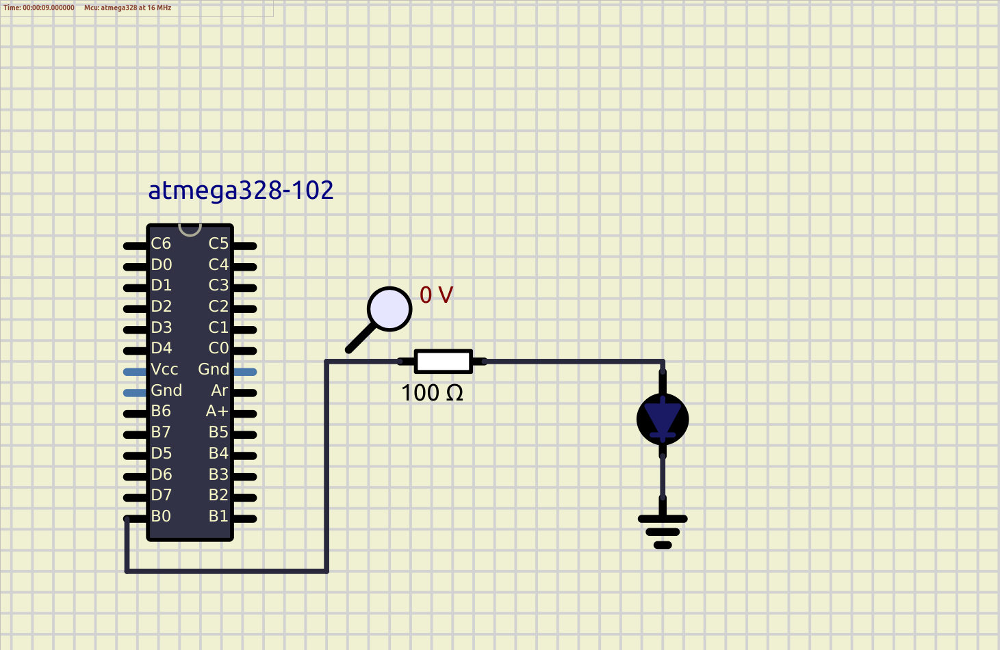

# Embedded C Programming Examples with Continuous Integration and Code Quality

## Activity 1

### In Action

## Activity 2

### In Action

|ON|OFF|
|:--:|:--:|
|||

## Activity 3

### In Action

|ON|OFF|
|:--:|:--:|
|||

## Activity 4

### In Action

|ON|OFF|
|:--:|:--:|
|||

#### CI and Code Quality

|Build|Cppcheck|Codacy|
|:--:|:--:|:--:|
|||

