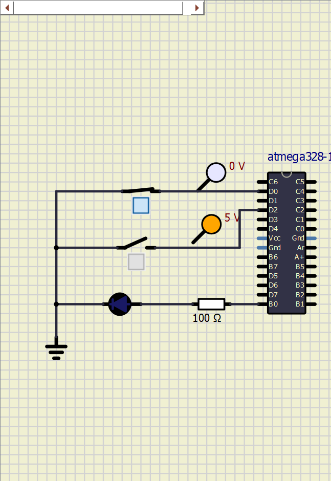
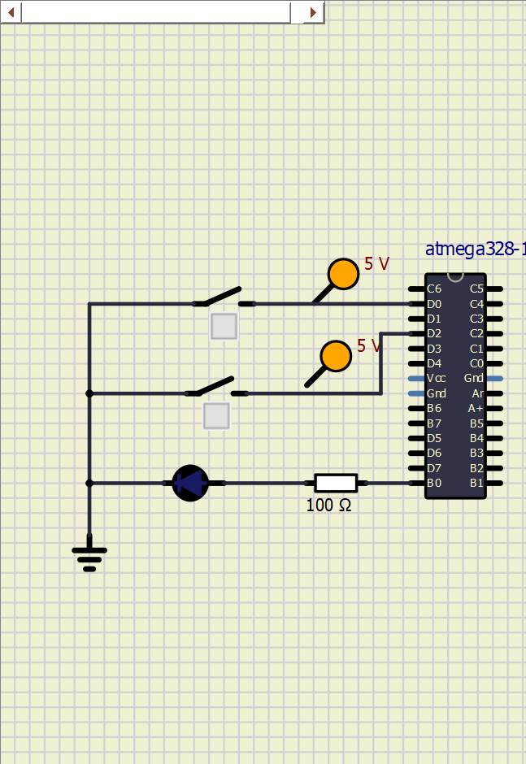
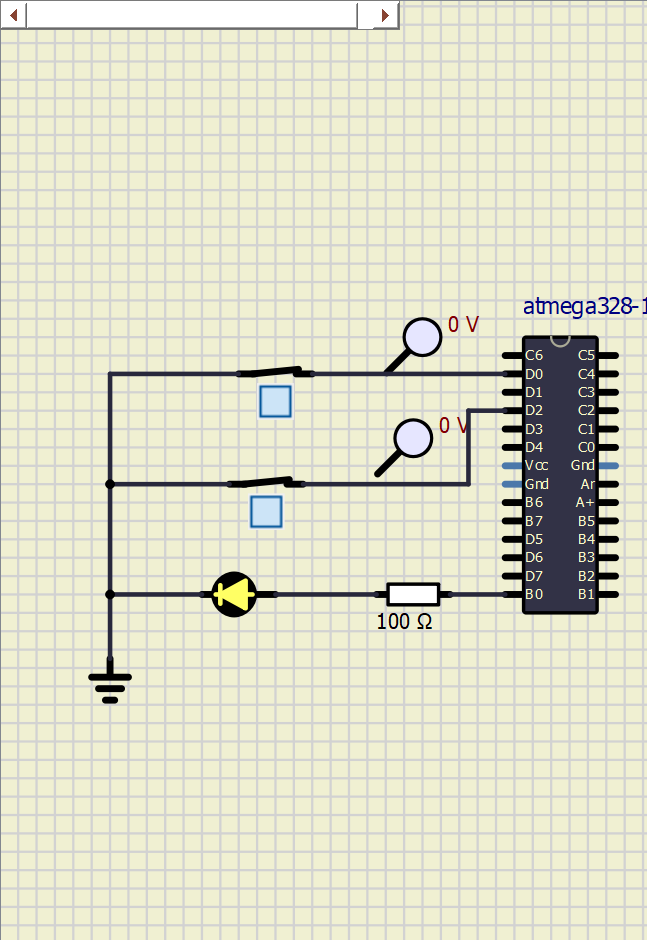
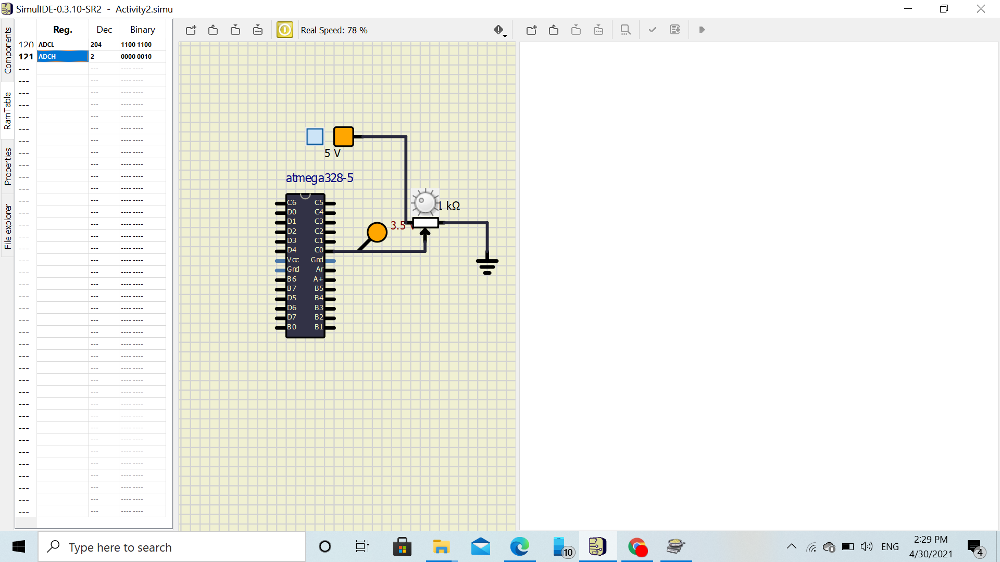
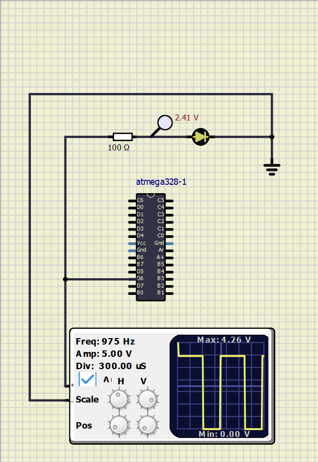
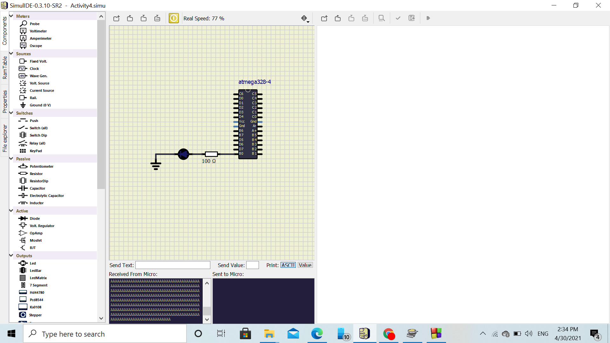
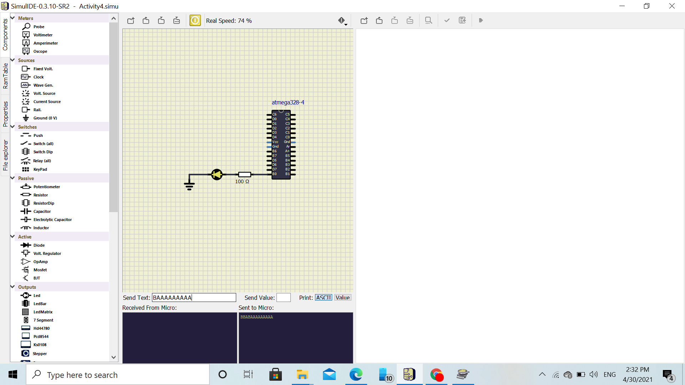

# Simulation Diagrams

## Activity 1

### Single Switch ON

### Both the Switches OFF

### Both the Switches ON

## Activity 2

### ADC Value Output

## Activity 3

### PWMOutput-LED ON

### PWMOutput-LED ON

## Activity 4

### Write Message in USART

### Read Message in USART

## Final Circuit

